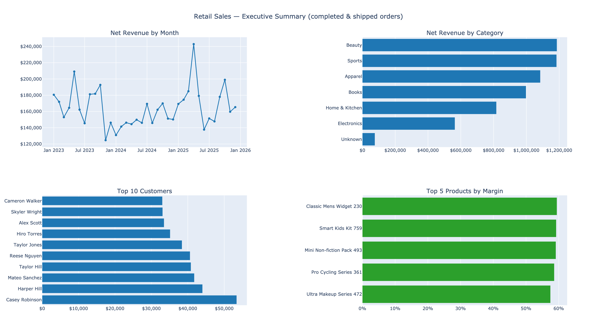
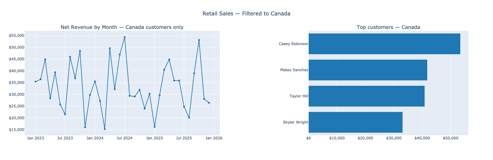

# Retail Sales Analytics Pipeline

End-to-end data pipeline that lands raw retail CSVs, cleans them with dbt
into a star schema, and exposes the marts to Power BI Desktop. The entire
data-pipeline side runs from a single command:

```bash
docker compose up --build
```

Built for the SkyPoint AI Coding Challenge — see [CHALLENGE.md](CHALLENGE.md)
for the original brief.

---

## 1. Overview

A mid-sized retailer drops daily sales exports as CSV files. This pipeline:

1. Picks them up from [landing/](landing/) (Python data generator + 5 raw CSVs)
2. Loads them into a DuckDB `raw` schema verbatim (all columns as VARCHAR)
3. Transforms them into a clean star schema with dbt (staging views + marts tables)
4. Tests the result with 35 dbt data-quality tests
5. Exports the marts as both DuckDB tables *and* Parquet files for Power BI

The Power BI report answers four business questions:

- **What are total sales by store, category, and month?**
- **Who are the top 10 customers by revenue?**
- **Which products have the highest and lowest margins?**
- **How does sales performance trend over time?**

---

## 2. Architecture

```
                            docker compose up --build
                                       │
                ┌──────────────────────┼──────────────────────┐
                ▼                                             ▼
        ┌───────────────┐                              ┌───────────────┐
        │   loader      │                              │     dbt       │
        │  (Python +    │  ─── raw.* tables ────▶     │ (dbt-duckdb)  │
        │   duckdb)     │                              │               │
        └───────┬───────┘                              └───────┬───────┘
                │                                              │
                ▼                                              ▼
        ┌──────────────────────────────────────────────────────────────┐
        │              warehouse/retail_data.db (DuckDB file)          │
        │                                                              │
        │   raw.customers, raw.orders, ...                             │
        │   staging.stg_customers, staging.stg_orders, ...   (views)   │
        │   marts.dim_customer, marts.fct_sales, ...         (tables)  │
        └────────────────────────┬─────────────────────────────────────┘
                                 │
                                 │  dbt run-operation export_marts_to_parquet
                                 ▼
                       warehouse/parquet/*.parquet
                                 │
                                 ▼
                       ┌────────────────────┐
                       │  Power BI Desktop  │
                       │     (Windows)      │
                       └────────────────────┘
```

**Service ordering.** The dbt service waits on
`depends_on: loader / condition: service_completed_successfully`. DuckDB is
a single-writer engine, so serializing loader → dbt also avoids any
concurrent-write conflict on the `.db` file.

**Persistence.** `./warehouse/` and `./landing/` are bind-mounted into the
containers, so the DuckDB file and Parquet exports survive on the host and
are immediately visible to Power BI Desktop without any copy step.

### Repo layout

```
├── landing/                  raw CSVs + reproducible Python generator
│   ├── generate_data.py
│   └── customers.csv, products.csv, stores.csv, orders.csv, order_items.csv
├── loader/                   CSV → DuckDB raw-schema loader
│   ├── Dockerfile
│   ├── load_csvs.py
│   └── requirements.txt
├── dbt_project/              dbt project (5 staging + 5 marts models)
│   ├── Dockerfile
│   ├── dbt_project.yml
│   ├── profiles.yml
│   ├── macros/
│   ├── models/staging/
│   ├── models/marts/
│   └── requirements.txt
├── powerbi/                  Power BI build instructions (Windows step)
│   ├── connection_setup.md
│   ├── semantic_model.md
│   ├── dax_measures.md
│   ├── report_layout.md
│   └── screenshots/          PNGs of the static HTML substitute report
├── analytics/                static-HTML executive summary (PBI substitute)
│   ├── report.py
│   ├── report.html
│   └── requirements.txt
├── warehouse/                produced at runtime (DuckDB file + Parquet)
├── docker-compose.yml
├── CHALLENGE.md              original brief
└── README.md
```

---

## 3. How to run

### Prerequisites

- Docker Desktop (or any Docker engine + Compose v2)
- ~1 GB free for the Python images
- No Python install needed on the host — everything runs in containers

### Steps

```bash
git clone <your-fork-url>
cd SkypointTest
docker compose up --build
```

That's the whole thing. The compose stack:

1. Builds `loader` (Python 3.11) and `dbt` (Python 3.9) images
2. Runs the loader → produces `warehouse/retail_data.db` populated with
   `raw.customers`, `raw.products`, `raw.stores`, `raw.orders`,
   `raw.order_items`
3. Runs `dbt build --target dev` → creates the `staging` and `marts`
   schemas and runs 35 tests
4. Runs `dbt run-operation export_marts_to_parquet` → writes
   `warehouse/parquet/{dim_*,fct_*}.parquet`
5. Exits cleanly (both containers stop)

### Expected output

```
retail_loader  | Schema `raw` ready.
retail_loader  |   loaded    500 rows -> raw.customers
retail_loader  |   loaded    100 rows -> raw.products
retail_loader  |   loaded     20 rows -> raw.stores
retail_loader  |   loaded   5000 rows -> raw.orders
retail_loader  |   loaded  15204 rows -> raw.order_items
retail_loader  | Done.
retail_loader exited with code 0
retail_dbt     | Done. PASS=45 WARN=0 ERROR=0 SKIP=0 NO-OP=0 TOTAL=45
retail_dbt     | Exported marts.dim_customer -> /data/warehouse/parquet/dim_customer.parquet
retail_dbt     | (...for each marts table)
retail_dbt exited with code 0
```

### Runtime

| Step | First run | Subsequent runs |
| --- | --- | --- |
| Image build (pip install) | ~2 min total | ~5 sec (cached) |
| Loader | ~5 sec | ~5 sec |
| dbt build + tests | ~5 sec | ~5 sec |
| Parquet export | ~2 sec | ~2 sec |

### Regenerating the CSVs (optional)

The CSVs in [landing/](landing/) are reproducible via the generator script,
seeded for determinism:

```bash
python3 landing/generate_data.py --seed 42
```

The default seed (42) reproduces exactly the data the assessor will see;
change the seed to test resilience to different draws of the same DQ
distribution.

---

## 4. Connecting Power BI

DuckDB is a **file-based** database — there is no server, host, port, or
username/password to configure. Connection happens by pointing Power BI at
either the `.db` file or the Parquet folder.

### Quick connection details

| Setting | Value |
| --- | --- |
| Database type | DuckDB (file) |
| Database path | `<absolute path to repo>/warehouse/retail_data.db` |
| Host / Port / Username / Password | **N/A** — file-based, no server |
| Schema to load | `marts` (not `raw` or `staging`) |
| Required driver (option A) | DuckDB ODBC driver |
| Required driver (option B) | None — native Parquet connector |

### Step-by-step

Full guide with screenshots-worth-of-detail is in
[powerbi/connection_setup.md](powerbi/connection_setup.md). Short version:

**Option A — DuckDB via ODBC** (primary, matches the challenge wording):

1. Install the DuckDB ODBC driver from
   [github.com/duckdb/duckdb/releases](https://github.com/duckdb/duckdb/releases)
   (asset: `duckdb_odbc-windows-amd64.zip`).
2. Open *ODBC Data Sources (64-bit)* → add a User DSN named `retail_data`
   pointing at the `.db` file.
3. Power BI Desktop → *Get Data → ODBC* → DSN `retail_data` → expand the
   `marts` schema → load all 5 tables.

**Option B — Parquet folder** (fallback if the ODBC driver is fiddly):

1. Power BI Desktop → *Get Data → Parquet* → point at
   `warehouse/parquet/<table>.parquet` for each of the 5 marts files.
2. Loads instantly, types preserved from dbt.

Both options surface the same data — choose whichever is less painful on
your Windows machine.

---

## 5. Data model

Classic star schema. One fact at the order-line grain, four conformed
dimensions.

### Fact

**`fct_sales`** — grain: one row per `(order_id, product_id)`

| Column | Description |
| --- | --- |
| `sales_key` | `md5(order_id || '\|' || product_id)` — surrogate key |
| `order_id` | natural key from source |
| `customer_id`, `store_id`, `product_id`, `date_key` | foreign keys |
| `order_date`, `status` | order-level attributes |
| `quantity`, `unit_price`, `unit_cost`, `discount_pct` | line-level |
| `gross_revenue` | `quantity × unit_price` |
| `discount_amount` | `gross_revenue × discount_pct` |
| `net_revenue` | `gross_revenue × (1 − discount_pct)` |
| `total_cost` | `quantity × unit_cost` |
| `gross_profit` | `net_revenue − total_cost` |

Inner-joins to all four dimensions, which cascade-drops any orphan-FK rows
that survived the staging filters.

### Dimensions

| Table | Grain | Notable columns |
| --- | --- | --- |
| `dim_customer` | one row per customer | normalized `country`, parsed `signup_date` |
| `dim_product`  | one row per product  | `margin_pct` (computed), `has_margin_issue` flag |
| `dim_store`    | one row per store    | normalized `country` |
| `dim_date`     | one row per day, 2020-01-01 → 2030-12-31 | `date_key` int (YYYYMMDD), `year_month`, `is_weekend`, weekday/month names — marked as Power BI date table |

### Noteworthy business logic (in staging)

The CSVs are deliberately seeded with realistic data-quality issues. The
staging layer normalizes them so the marts can stay clean:

- **Country normalization** — `USA / usa / U.S.A. / United States` → `USA`,
  similar collapsing for UK / Canada / Germany / Australia
- **Status normalization** — `Completed / completed / COMPLETED / complete`
  collapse to lowercase canonical, `canceled` ↔ `cancelled`
- **Date parsing** — accepts both `YYYY-MM-DD` and `MM/DD/YYYY` for
  customer signup dates; year-2099 typos in `orders.order_date` filtered
- **Discount unit normalization** — `discount_pct` arrives sometimes as a
  decimal (0.25) and sometimes as a whole percent (25). Whole numbers in
  `(1, 100]` are interpreted as percents; non-integer values outside
  `[0, 1]` are treated as junk and dropped
- **Dedup** — duplicate customer_ids and order_ids collapse to the first
  occurrence; duplicate `(order_id, product_id)` line items are removed
- **Orphan-FK drop** — orders referencing non-existent customers or stores
  fall out at the fact's inner joins; order_items referencing missing
  products do the same
- **Negative-margin flag** — products where `unit_cost > unit_price` get
  `has_margin_issue = TRUE` rather than being deleted, so analysts can
  optionally include or exclude them

End-to-end data attrition from the deliberate DQ issues:

| Layer | customers | orders | order_items |
| --- | --- | --- | --- |
| raw | 500 | 5,000 | 15,204 |
| staging | 497 | 4,964 | 14,748 |
| marts (fact) | 497 | n/a | 14,052 |

---

## 6. DAX measures

Full DAX with format strings and the business-question mapping is in
[powerbi/dax_measures.md](powerbi/dax_measures.md). Summary:

**Revenue (3)**: `Net Revenue`, `Gross Revenue`, `Discount Amount`

**Profitability (3)**: `Total Cost`, `Gross Profit`, `Margin %`

**Volume (4)**: `Total Quantity`, `Order Count`, `Customer Count`,
`Avg Order Value`

**Filtered to completed business (2)**: `Net Revenue (Completed)`,
`Gross Profit (Completed)` — exclude `cancelled`/`returned` orders

**Time intelligence (5)**: `Net Revenue PY`, `Revenue YoY`, `Revenue YoY %`,
`Net Revenue YTD`, `Net Revenue MTD` — all require `dim_date` to be marked
as the date table

**Optional (1)**: `Margin Issue Count` — counts products carrying the
`has_margin_issue` flag

**Mapping to the four business questions:**

| Question | Measure(s) | Visual |
| --- | --- | --- |
| Sales by store / category / month | `Net Revenue` | Matrix + stacked bar |
| Top 10 customers by revenue | `Net Revenue` | Table with Top N visual filter |
| Highest / lowest margin products | `dim_product[margin_pct]` (column, not measure) | Two top-5 tables |
| Sales trend over time | `Net Revenue`, `Revenue YoY %` | Line chart on date hierarchy |

---

## 7. Tech stack

| Component | Version | Why |
| --- | --- | --- |
| Docker Compose | v2 (no `version:` key) | Single-command orchestration |
| Python (loader) | 3.11-slim | Standard, slim base |
| Python (dbt) | 3.9-slim | dbt-duckdb 1.8.4 references a `'javascript'` model language that dbt-core 1.10+ on Python 3.11 rejects — pinning the dbt image to 3.9 is the minimal-friction workaround. See "Known limitations" below. |
| DuckDB (loader) | 1.1.3 | Modern, fast, file-based |
| DuckDB (dbt adapter) | pulled by `dbt-duckdb` | Forward-compatible 1.x file format |
| dbt-core | 1.10.20 | Latest stable that pairs cleanly with `dbt-duckdb==1.8.4` |
| dbt-duckdb | 1.8.4 | Pinned to a known-good version against dbt-core 1.10 |
| Power BI Desktop | latest | Windows-only, free |
| DuckDB ODBC driver | latest from GitHub releases | Power BI ↔ DuckDB bridge |

No dbt packages are required (no `packages.yml`) — `dim_date` is built
from DuckDB's `range()` table function, avoiding a dependency on
`dbt_utils.date_spine`.

---

## 8. Screenshots

Power BI Desktop is Windows-only and the assessment was developed on
macOS. As a time-constrained substitute the same four business questions
are answered by a static HTML report rendered by
[analytics/report.py](analytics/report.py) (DuckDB + Plotly). The PNGs
below are exports from that report.



*[report_overview.png](powerbi/screenshots/report_overview.png) — four-quadrant overview: revenue trend, revenue by category, top 10 customers, top 5 products by margin.*



*[report_filtered.png](powerbi/screenshots/report_filtered.png) — same data filtered to the strongest country (Canada), demonstrating how a slicer would behave in the equivalent Power BI report.*

The full interactive version lives at
[analytics/report.html](analytics/report.html) — open it in any browser.

To regenerate the report and PNGs (assumes `docker compose up --build`
has produced `warehouse/retail_data.db`):

```bash
python3 -m venv .venv
.venv/bin/pip install -r analytics/requirements.txt
.venv/bin/python analytics/report.py
```

> **Why a substitute?** Power BI Desktop doesn't exist on macOS, and a
> Windows machine wasn't available within the time budget for the
> challenge. The full Power BI design is specified in [powerbi/](powerbi/)
> (connection, semantic model, full DAX, layout) and is intended to be
> assembled in ~30 min on a Windows machine — at which point the `.pbix`
> would replace this HTML stand-in. The static report uses the same marts
> and answers the same four business questions, so the analytical content
> is equivalent; what's missing is the interactive Power BI semantic
> model and the `.pbix` file itself.

---

## 9. Known limitations

Honest list of things that are deliberately scoped out or known rough edges.

1. **`.pbix` file not committed.** Power BI Desktop is Windows-only and
   was developed on macOS. As a substitute,
   [analytics/report.py](analytics/report.py) renders the same four
   business questions as a static HTML report (Plotly), and two PNG
   exports of that report are committed under
   [powerbi/screenshots/](powerbi/screenshots/) and embedded in §8. The
   full Power BI build is specified in [powerbi/](powerbi/) and is
   intended to be assembled in ~30 min on a Windows machine, at which
   point the `.pbix` would replace the HTML stand-in. Estimated time on
   Windows with the DuckDB ODBC driver installed: ~30 min.

2. **dbt image pinned to Python 3.9.** `dbt-duckdb==1.8.4` declares macros
   with `supported_languages=['sql', 'python', 'javascript']`, and
   `dbt-core` on Python 3.11 raises `KeyError: 'javascript'` when parsing
   them — the `ModelLanguage` enum doesn't recognize `'javascript'`. The
   same combination on Python 3.9 parses fine. A cleaner fix would be to
   move to `dbt-duckdb>=1.9` (which dropped the JavaScript declaration)
   and back to Python 3.11. Out of scope for the time budget.

3. **`dim_date` is wider than needed.** Covers 2020-01-01 → 2030-12-31, but
   the fact only spans 2023-2025. Easy to tighten if file size or memory
   matters; left wide so future synthetic data with different dates still
   joins cleanly.

4. **Status `accepted_values` test set to `severity: warn`.** Set as a
   warning rather than an error because some seeded raw status values
   are deliberately weird; staging normalizes the common ones to lowercase
   canonical, but anything truly novel passes through and would otherwise
   break the build.

5. **Discount unit heuristic has an ambiguous range.** `discount_pct`
   values in `(1, 100]` are interpreted as percent (so `25` → `0.25`),
   but only if they're whole numbers. Decimal values like `2.7` that
   came from the deliberately-seeded "absurd discount" generator (270%)
   get filtered to NULL instead. Real-world variants of this rule would
   need source-system context.

6. **Cancelled & returned orders included in the fact.** The fact carries
   every status; the DAX layer provides parallel `* (Completed)` measures
   for the headline KPIs. Some BI conventions filter at the warehouse
   level — left at the fact level here so analysts can choose.

7. **No incremental loads.** Both the loader and dbt re-create everything
   on each run (`CREATE OR REPLACE TABLE` / `materialized: table`). Fine
   for 20k rows; would need an incremental strategy at production scale.

8. **No CI / no production profile.** Single dev target, no separate prod
   profile, no GitHub Actions config. Out of scope for the time budget.

9. **No data-quality dashboards.** The `has_margin_issue` flag and the
   accepted_values warnings expose DQ signals, but there's no dedicated
   monitoring layer. Could be added as additional dbt tests with
   `severity: warn` and a separate `dq_*.sql` model surface.
